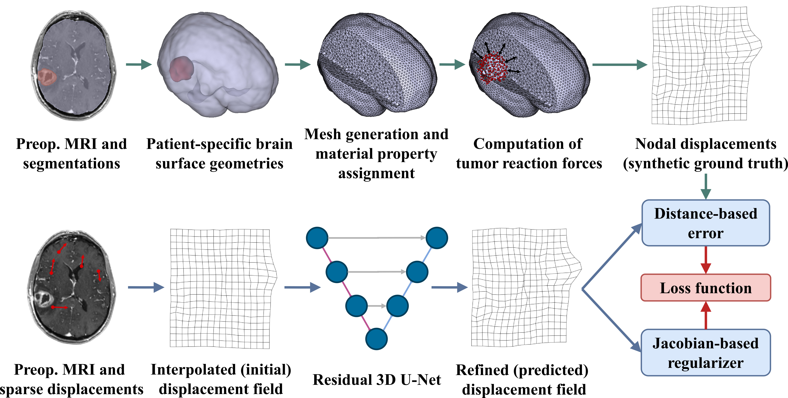
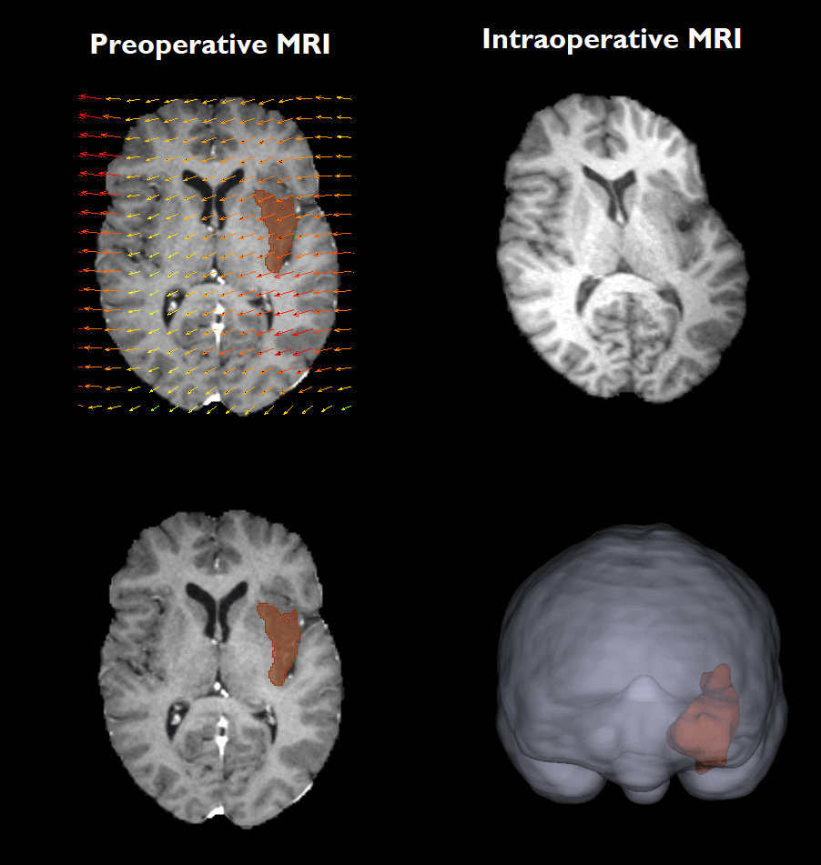

# Deep Biomechanically-Guided Interpolation for Keypoint-Based Brain Shift Registration

This repository provides the implementation for interpolating and predicting biomechanically-corrected displacement fields, as described in Section 2.4 of our paper: [Deep Biomechanically-Guided Interpolation for Keypoint-Based Brain Shift Registration](https://doi.org/10.1007/978-3-032-09784-2_11).

The code for the synthetic ground truth generation pipeline will be made available in a future release.

\
Accurate compensation of brain shift is critical for maintaining the reliability of neuronavigation during neurosurgery. This work proposes a novel deep learning framework that helps estimate dense, physically plausible brain deformations from sparse matched keypoints. We first generate a large dataset of synthetic brain deformations using biomechanical simulations. Then, a residual 3D U-Net is trained to refine standard interpolation estimates into biomechanically guided deformations. Experiments on a large set of simulated displacement fields demonstrate that our method significantly outperforms classical interpolators, reducing the mean square error while introducing negligible computational overhead at inference time.

## Framework Overview
The core of our method is a deep, biomechanically guided "interpolator" that refines an initial displacement field.

The process to train the model was performed as follows:

  1. **Synthetic Data Generation**: We generate a large dataset of realistic, synthetic brain deformations using biomechanical simulations from preoperative MRI data from the UPENN-GBM dataset. The simulations of brain deformation are driven by gravity and tissue resection.

  2. **Keypoint Extraction**: Sparse matched keypoints are simulated. Keypoints are extracted from the preoperative MRI using 3D SIFT-Rank, and their corresponding displacement vectors are retrieved from the ground-truth synthetic displacement fields.

  3. **Deep Interpolation**:

        - An initial dense displacement field is created from the sparse keypoints using a standard interpolation method (e.g., 3D linear interpolation or thin-plate splines).

        - A residual 3D U-Net takes the preoperative MRI and the initial displacement field as input.

        - The network is trained to predict a residual displacement field, which adds to the initial interpolated one to refine it to be more physically plausible and accurate to the biomechanical behaviors of the brain under resection.

        - The model is trained with a voxel-wise error loss and a Jacobian-based regularization loss to constrain the network from deviation from biomechanical realism.


**Fig 1.** Overview of our training framework. The synthetic ground truth generation pipeline is depicted with green arrows. The pipeline depicted with blue arrows shows the interpolation of sparse matched keypoint displacements and correction to a biomechanically plausible dense displacement field with a 3D residual U-Net.

## Citation

If this work is useful to you, please consider citing the original paper!
```
@inproceedings{assis2025deep,
author="Assis, Tiago and Machado, Ines P. and Zwick, Benjamin and Garcia, Nuno C. and Dorent, Reuben",
editor="Dou, Qi and Ban, Yutong and Jin, Yueming and Bano, Sophia and Unberath, Mathias",
title="Deep Biomechanically-Guided Interpolation for Keypoint-Based Brain Shift Registration",
booktitle="International Workshop on Collaborative Intelligence and Autonomy in Image-Guided Surgery",
year="2025",
publisher="Springer Cham",
pages="105--115",
isbn="978-3-032-09784-2",
doi="https://doi.org/10.1007/978-3-032-09784-2_11"
}
```

## Installation

You can clone this repository using:
```
git clone https://github.com/tiago-assis/Deep-Biomechanical-Interpolator.git
cd Deep-Biomechanical-Interpolator
```

## Requirements
| | | |
|----------|------|-|
| Python 3.9+ | PyTorch | NumPy |
| MONAI  | SimpleITK | scikit-learn |
| SciPy | NiBabel | pynrrd |
| natsort | tqdm | Matplotlib |

PyTorch 2.7 with CUDA 12.4+ was tested on NVIDIA RTX 4080 16GB and NVIDIA A100 40/80GB.

 \
Install dependencies using:
```
pip install -r requirements.txt
```

## Training
To reproduce the training done in this work, you will be required to download our custom dataset [NeuriPhy](https://zenodo.org/records/15381866) (TBD) that comprises: preoperative MRI data, brain and tumor segmentations, extracted keypoints, and biomechanically simulated displacement fields.

\
You can then set up the training configuration file and run the following script:
```
python train.py --configs /your/configs.json
```

The training script is highly modular, allowing the configuration of several aspects of the pipeline. The allowed arguments for configuring the `train.py` script are described in detail here -> .

## Inference with your own data!
To run a pre-trained model, please download the weights in .

\
Three approaches can then be taken:

**1.** You have access to an initial displacement field and want to run the model for **displacement field correction** only. This displacement must be in H5 or NPZ format.

Example script:
```
python inference.py \
  -p /path/to/preoperative/scan.nii.gz \
  -i /path/to/initial/displacement/field.h5 \
  -d cuda \
  -o /path/to/output/directory
  -f h5
```

\
**2.** You have access to matched keypoints and their respective sparse displacements and want the framework to (1) **interpolate** and then (2) predict a **corrected** dense displacement field.
- A text file with keypoint coordinates and displacement vectors should be provided.
  - The coordinates should be in voxel space.
  - The file should follow the format: `x, y, z, disp_x, disp_y, disp_z`
- Linear or thin plate spline interpolation modes should be chosen

Example script:
```
python inference.py \
  -p /path/to/preoperative/scan.nii.gz \
  -k /path/to/keypoints/and/displacements.csv \
  -m linear \
  -d cuda \
  -o /path/to/output/directory/
  -f h5
```

\
**3.** You can directly **integrate the model into your code** as an interpolation step by importing the relevant classes (see [inference.py](https://github.com/tiago-assis/Deep-Biomechanical-Interpolator/blob/98ddf63f312ff566c580280626d2f248cba2faa9/inference.py#L106)) and feeding the model a concatenated (4,D,H,W) tensor, including the normalized preoperative ceT1 MRI (1,D,H,W) and initial displacement vector field (3,D,H,W).

<br>

| Argument | Type | Default | Description |
|----------|------|---------|-------------|
| `-p`, <br> `--preop_scan` | `str` | **Required** | Path to the preoperative scan (`.nii` or `.nii.gz`). |
| `-i`, <br> `--init_disp` | `str` | `None` | Path to the initial displacement field (`.h5`). If not provided, it will be generated by interpolating the provided keypoints. |
| `-k`, <br> `--kpt_disps` | `str` | `None` | Path to the keypoint displacements file (`.csv` or `.txt`). Only required if no initial displacement field is given. |
| `-m`, <br> `--interp_mode` | `str` | `'linear'` | Interpolation mode used to generate the initial field (`tps` or `linear`). |
| `-d`, <br> `--device` | `str` | `'cuda'` | Device to run the model on (`cuda` or `cpu`). |
| `-o`, <br> `--output` | `str` | `'.'` | Directory to save the output displacement field. |
| `-f`, <br> `--output_fmt` | `str` | `'h5'` | Output format for the displacement field (.h5 SimpleITK transform or .npz numpy compressed array) |
| `-w`, <br> `--weights` | `str` | `'./checkpoints/res-unet-se_mixedinterp_32_200_5e-4.pt'` | Path to the model weights. Please download the latest weights from [here](https://github.com/tiago-assis/Deep-Biomechanical-Interpolator/tree/main/checkpoints). |

## Acknowledgements

- The [UPENN-GBM](https://doi.org/10.7937/TCIA.709X-DN49) dataset provided the preoperative patient MRI scans and segmentations for our study.
- The biomechanical framework by Yu *et al.* [[1]](https://doi.org/10.1002/cnm.3539), [[2]](https://doi.org/10.1016/j.compbiomed.2022.105271) was used to generate synthetic ground-truth brain deformations.
- [SynthSeg](https://github.com/BBillot/SynthSeg) [[3]](https://doi.org/10.1016/j.media.2023.102789) was employed to segment the brain parenchyma and cerebrospinal fluid from the MRI scans.
- The [3D SIFT-Rank](https://github.com/3dsift-rank/3DSIFT-Rank/tree/Appearance%2BGeometry) [[4]](https://doi.org/10.1016/j.neuroimage.2019.116208) algorithm was utilized to extract sparse anatomical keypoints from the preoperative images.
- These publicly available implementations of the [Delaunay triangulation-based linear interpolation](https://github.com/SamuelJoutard/DrivingPointsPredictionMIR/blob/01e3dd8c4188e70a6113209335f2ecaf1ce0a75d/models.py#L802) and [thin plate spline interpolation](https://github.com/mattiaspaul/VoxelMorphPlusPlus/blob/0f8da77b4d5bb4df80d188188df9725013bb960b/src/utils_voxelmorph_plusplus.py#L271) algorithms were used as a baseline and to compute initial displacement fields.
- Part of the code used for implementing the network architectures can be publicly found [here](https://github.com/alanqrwang/keymorph/tree/dcb799622b2b60877dad27e9705ae6408cdb491c/keymorph/unet3d).

## Cool registration GIF!
<p align="center">

</p>


